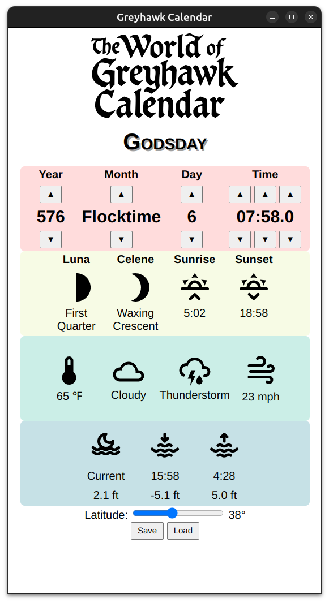

# Greyhawk Calendar



A web-based tool for tracking time and dynamically generating celestial events, weather, and tides in the World of Greyhawk for Dungeons & Dragons campaigns.

## ✨ Features

- 🗓️ **Fully Accurate Greyhawk Calendar**  
  Supports all 12 months, 4 festival weeks, and weekday tracking (Starday through Freeday).

- 🌙 **Celestial Phases**  
  Accurately calculates and displays the phases of Luna and Celene with custom SVG icons.

- 🌤️ **Dynamic Weather Simulation**  
  - Temperature calculated using seasonal sine-based variation.
  - Sky conditions and precipitation types based on classic Greyhawk tables.
  - Continuation rules prevent weather from changing too abruptly.

- 🌅 **Sunrise and Sunset Times**  
  Calculated based on latitude using Earth-like approximations.

- 🌊 **Tide Generator**  
  Combines lunar and solar gravitational effects for high/low tide simulation, including tide strength and timing.

- 🌬️ **Wind Conditions**  
  Wind speed and a hover-enabled tooltip for interpreting in-game effects (based on AD&D high wind tables).

- 🧭 **Latitude Control**  
  Adjustable slider to simulate different regions or elevations — affects sunrise/sunset and base temperature.

- 💾 **Save/Load State**  
  Easily save and resume your campaign’s calendar and weather with a single click.

## 🔧 How to Use

1. Clone the repo:
   ```bash
   git clone https://github.com/gumyr/GreyhawkCalendar.git

2. Open `calendar.html` with your browser.